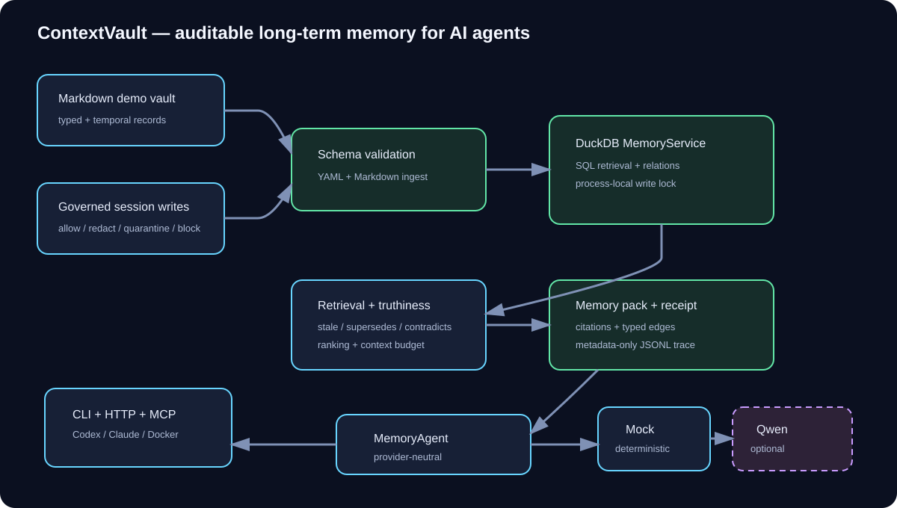

# ContextVault MemoryAgent

[](https://github.com/panualaluusua/contextvault-memoryagent/actions/workflows/ci.yml)

Canonical repository: <https://github.com/panualaluusua/contextvault-memoryagent>

ContextVault is an auditable, governed long-term memory layer for AI agents. It
turns typed Markdown records and session preferences into compact memory packs
with citations, temporal truth resolution, policy-controlled writes, and a
human-readable context receipt.

The core is provider-neutral and runs fully offline with a deterministic mock.
Optional adapters support local Ollama and Qwen-compatible endpoints.



## Why it exists

Agents often lose project decisions and user preferences between sessions.
Naive retrieval can also repeat outdated or conflicting notes. ContextVault
addresses both problems:

- persistent cross-session recall in embedded DuckDB;
- typed memories: facts, preferences, decisions, source notes, and warnings;
- temporal `valid_from`, `valid_until`, and `recorded_at` metadata;
- deterministic `supersedes` and `contradicts` truth resolution;
- governed writes with `allow`, `redact`, `quarantine`, and `block` outcomes;
- budget-limited memory packs with source paths and one-hop relations;
- metadata-only JSONL traces and trace-derived context receipts.

## Evidence

- 47 automated tests, including FastMCP protocol, concurrency, API-auth, and provider coverage.
- Real subprocess E2E coverage for cross-session writes and recall.
- Real container E2E for health, write, and agent-answer requests.
- Deterministic with-memory versus without-memory baseline evaluation.
- Non-root Docker runtime with a persistent `/data` volume.

## Quick start

Requirements: Python 3.11+.

```powershell
python -m pip install -e .
contextvault demo
contextvault evaluate
python -m pytest -q
```

For a terminal recording, force presentation colors:

```powershell
contextvault demo --color always
```

The demo highlights allowed and blocked writes, selected memories, stale
exclusions, sources, and the final context receipt. `--color auto` is the
default; use `--color never` for plain logs.

If editable installation is unavailable, run directly from the source tree:

```powershell
$env:PYTHONPATH = "src"
python -m contextvault demo
python -m contextvault evaluate
python -m pytest -q
```

The demo resets only `.tmp/portfolio-demo.duckdb` and its trace. It shows:

1. an allowed preference write and a blocked secret-like write;
2. recall from a separately opened session;
3. rejection of a stale architecture memory;
4. selected relations and source citations;
5. a receipt rendered from the JSONL trace.

## Docker

```powershell
$env:CONTEXTVAULT_API_TOKEN = "replace-with-a-local-token"
docker compose up --build
```

The API listens on `127.0.0.1:8080`. See [HTTP API](docs/API.md) for endpoint
contracts and curl examples.

## Architecture

```text
Markdown vault / governed session writes
                  |
             validation
                  |
          DuckDB MemoryService
           /       |        \
     retrieval  truthiness  typed relations
           \       |        /
         budgeted memory pack + receipt
                  |
            MemoryAgent
           /           \
 deterministic mock   optional Ollama / Qwen providers
                  |
             CLI / HTTP API
```

The HTTP layer reuses the same `MemoryService` and `MemoryAgent`; it does not
implement a second retrieval path. The MVP intentionally uses one server
process. Writes from threads in that process are explicitly serialized; DuckDB
is not presented as a multi-process or horizontally scaled write store.

## Codex and Claude Code MCP

ContextVault now includes a local read-only FastMCP adapter with four tools for
context retrieval, individual memories, relations, and receipts. Both Codex and
Claude Code use the same `contextvault-mcp` stdio server. See the complete
[MCP setup guide](docs/MCP.md).

## Evaluation

Golden cases are versioned in `data/evaluation/golden_cases.json`.

```powershell
contextvault evaluate --output docs/evaluation/baseline-report.md
```

The evaluator seeds 60 versioned synthetic distractors and reports recall@3,
MRR, and retrieval latency. Separately, the deterministic mock checks only a
`source:` citation contract with and without memory. That 100% versus 0%
contract result is not model accuracy, answer quality, or semantic relevance.
Memory-pack assertions cover stale correction, relations, citations, and
structural character budgets.

## Optional local Ollama integration

Set `OLLAMA_MODEL` and optionally `OLLAMA_BASE_URL` (default
`http://127.0.0.1:11434`), then use `--provider ollama`. Tests verify the native
Ollama request/response contract with a fake transport; a live smoke test still
requires an installed local Ollama endpoint and model.

## Optional Qwen integration

Copy `.env.example` to `.env`, load the values into your shell, and provide:

- `QWEN_API_KEY`
- `QWEN_BASE_URL`
- `QWEN_MODEL`

Then use `contextvault ask ... --provider qwen` or start the API with
`contextvault serve --provider qwen`. Credentials are never required by tests
and must not be committed.

## Security and privacy boundaries

- The API token is optional for local use but required for any public deployment.
- TLS, public rate limiting, backups, and secret management belong at the host
  or reverse-proxy layer.
- Traces store task hashes, selected slugs, outcomes, and timing—not raw tasks or
  memory bodies.
- The demo vault contains synthetic public data only.
- This is a single-user portfolio MVP, not a multi-tenant production service.

## Current limitations

- Public hosting has not been selected.
- Live Qwen verification is pending and optional for the portfolio version.
- DuckDB writes are serialized only within one process; multiple writer
  processes or replicas are out of scope.
- Retrieval is deterministic lexical ranking, not embedding search.
- Authentication is a shared bearer token, not user identity management.

## Repository map

```text
src/contextvault/       memory, governance, truthiness, providers, CLI and API
data/demo-vault/        synthetic Markdown memory records
data/evaluation/        versioned golden cases
tests/                  unit, integration, subprocess and HTTP tests
docs/                   API, status, evaluation and architecture artifacts
EVALUATION.md            executable RALP quality gates and evidence
```

## Project history

ContextVault began as a Qwen Cloud MemoryAgent hackathon concept and was
significantly implemented during the event period. The core was deliberately
kept portable after cloud account, privacy, and cost constraints made a single
vendor an unsuitable dependency.

## License

MIT. See [LICENSE](LICENSE).
